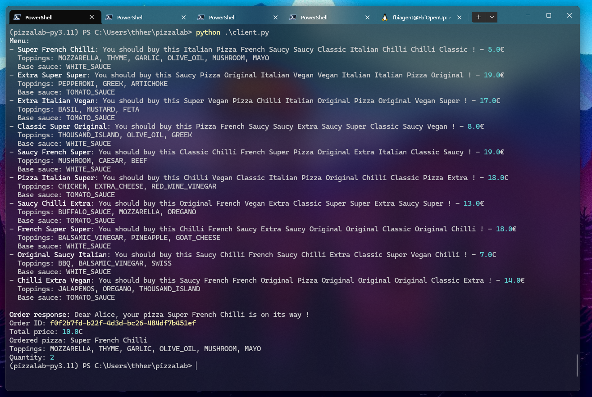

## 🍕 Welcome to the Pizzaria !

The goal was to build a server in gRPC to learn it.

### Features
- Using [betterproto](https://github.com/danielgtaylor/python-betterproto) for fully typed proto generated python files
- Using [grpclib](https://github.com/vmagamedov/grpclib) for a pure-Python gRPC implementation, asyncio compatible
- Fully async, typed, and cool
- Reflection (almost)

### Reflection
Reflection capability has been implemented, but because of [this bug](https://github.com/danielgtaylor/python-betterproto/issues/443) in betterproto, only services can be listed, not methods.\
If you want to call methods, you need to include the protos files, see the examples.

### Installation
🐍 Python version : 3.11, *I think it's compatible for higher versions*

```bash
poetry install
poetry shell
```

If you edit the protos files, you can rebuild it quickly by running the `build.ps1`

### Examples

#### Using `client.py`



#### Using grpclient

Listing services :

```bash
> grpcurl -vv -plaintext localhost:50051 list
pizzarpc.PizzaService
Timing Data: 11.5359ms
  Dial: 8.3544ms
    BlockingDial: 8.3544ms
```

Listing methods :

```bash
> grpcurl -import-path protos/ -proto methods.proto -proto pizza.proto -vv -plaintext localhost:50051 list pizzarpc.PizzaService
pizzarpc.PizzaService.GetMenu
pizzarpc.PizzaService.OrderPizza
Timing Data: 5.304ms
```

Executing a method :

```json
> grpcurl -import-path protos/ -proto methods.proto -proto pizza.proto -vv -plaintext localhost:50051 pizzarpc.PizzaService/GetMenu

Resolved method descriptor:
rpc GetMenu ( .pizzarpc.MenuRequest ) returns ( .pizzarpc.MenuResponse );

Request metadata to send:
(empty)

Response headers received:
content-type: application/grpc+proto

Estimated response size: 844 bytes

Response contents:
{
  "pizzas": [
    {
      "name": "Saucy Vegan Pizza",
      "description": "You should buy this super Saucy Vegan Pizza !",
      "price": 9,
      "toppings": [
        "MUSHROOM",
        "OREGANO",
        "MAYO"
      ],
      "baseSauce": "BURGER_SAUCE"
    },
    {
      "name": "French Extra French",
      "description": "You should buy this super French Extra French !",
      "price": 19,
      "toppings": [
        "THYME",
        "KETCHUP",
        "SPINACH"
      ],
      "baseSauce": "BURGER_SAUCE"
    },
    {
      "name": "Classic Pizza Super",
      "description": "You should buy this super Classic Pizza Super !",
      "price": 14,
      "toppings": [
        "WHITE_WINE_VINEGAR",
        "PARMIGIANO_REGGIANO",
        "ARTICHOKE"
        [...]
```